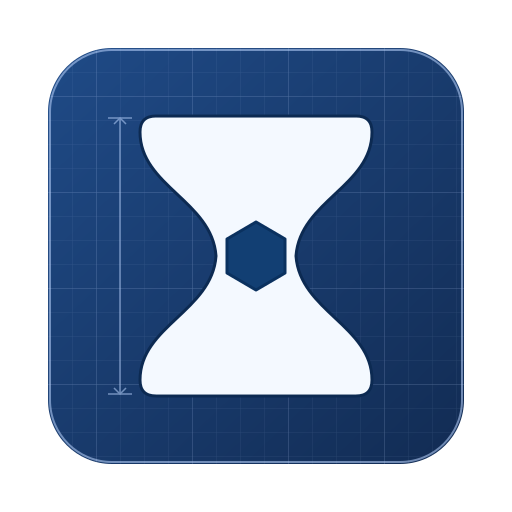

<div align="center">
  
  <h1>Bottleneck v1.0.0</h1>
  <p><strong>AI-Native WIP-Constrained Production Workflow</strong></p>
</div>

Bottleneck is a portable agent skill for large, multi-step work where shallow breadth causes context pollution, competing partial implementations, low-quality accumulation, or endless local polishing.

It is a **production workflow**, not a product architecture or runtime design pattern. The same workflow can guide software development, agentic 3D/visual hardening, simulations, research, dashboards, and other iterative production.

The core loop is:

> **See whole → Select one dominant bottleneck → Define closure → Construct → Observe → Correct → Validate → Close or Reopen → Advance**

The key scope rule is:

> **One dominant problem × the smallest coherent scope needed to solve it.**

A Bottleneck slice does not need to match a code module, mesh object, scene node, research section, or single capability. Tightly coupled causes should stay together when separating them would reduce whole-artifact quality.

## Skill payload

The distributable payload lives under `skills/bottleneck/`. It contains only files an agent may need at runtime:

- `SKILL.md` — the skill contract and instructions.
- `agents/openai.yaml` — optional Codex UI metadata.
- `references/`, `scripts/`, `templates/`, and `assets/` — progressive-disclosure resources.

Repository documentation, examples, evals, tests, manifests, and Claude marketplace metadata remain at the repository root and are not part of the skill payload.

## Invocation

Use the skill by name or slash command:

```text
/bottleneck
```

After installation, invoke the skill as `$bottleneck` in Codex or `/bottleneck` in Claude Code. The canonical entry point is always `skills/bottleneck/SKILL.md`.

## Installation

### Claude Code, Codex, and other compatible agents

The repository follows the open agent skills layout, so the Vercel `skills` CLI can discover `skills/bottleneck/SKILL.md` directly:

```bash
npx skills add ictseoyoungmin/bottleneck --skill bottleneck --agent claude-code --agent codex --global --copy --yes
```

For a local checkout, replace the repository argument with `.`. Omit `--global` to install into the current project.

### Claude Code plugin installation

This repository also includes a Claude marketplace and plugin manifest:

```text
/plugin marketplace add ictseoyoungmin/bottleneck
/plugin install bottleneck@bottleneck
```

Marketplace installation uses `skills/bottleneck/` as the plugin source, so the installed plugin contains the runtime payload instead of repository docs, tests, or evals. Claude Code plugin skills are namespaced; invoke this install as `/bottleneck:bottleneck`.

Validate a local checkout with:

```bash
claude plugin validate .
claude --plugin-dir .
```

### Codex local discovery

Codex discovers installed skills from its `.agents/skills` locations. After the `npx skills add` command, start Codex and invoke it explicitly with `$bottleneck`, or let the description trigger it implicitly.

## Package contents

- `skills/bottleneck/SKILL.md` — primary behavior contract and activation description.
- `skills/bottleneck/references/` — state, upstream constraints, closure, context, selection, anti-patterns, and domain adapters.
- `skills/bottleneck/templates/` — persistent project artifacts.
- `skills/bottleneck/scripts/bottleneck.py` — optional zero-dependency WIP=1 state harness and audit.
- `tests/` — regression tests for the harness (development-only).
- `evals/evals.json` — behavioral eval cases for the skill itself (development-only).
- `examples/` — domain examples.
- `skills/bottleneck/assets/icon.svg` — text-free symbolic icon.
- `.claude-plugin/` — Claude Code plugin and marketplace manifests.
- `.codex-plugin/` — Codex plugin manifest.

## Development checks

```bash
python3 -m unittest discover -s tests -v
claude plugin validate .
```

The checks above use only repository files and installed CLIs; they do not depend on an agent's private skill installation paths.

## Design principles

1. **Production WIP = 1 dominant bottleneck.**
2. **Workflow bookkeeping never dictates product architecture, runtime design, scene structure, or artifact topology.**
3. **Macro correctness before micro detail.** Reopen upstream work when its premise fails.
4. **One dominant problem × the smallest coherent scope needed to solve it.**
5. **Closure is quality-based.** Tests, screenshots, metrics, renders, and QA are evidence, not closure by themselves.
6. **Construction → observation → correction → validation.** Verification must not outrun production quality.
7. **Highest-impact remaining bottleneck first.** Stop polishing once an issue is no longer the dominant limiter.
8. **Define `change`, `do not change`, and `closed when` before deep work.**
9. **Closed work may be reopened when new evidence invalidates it.**
10. **Closed work becomes reusable output plus compressed authoritative context.**

## Example usages

### Build software without turning the workflow into architecture

> Build an analytics platform with dashboards, alerts, reports, team management, and billing. Use Bottleneck.

Bottleneck keeps the whole product visible, then selects the dominant unresolved production problem. A workflow slice may coincide with a subsystem, but it does not have to. Existing architecture remains authoritative unless the product itself needs architectural change.

```text
WHOLE: analytics product shape and primary user flows understood
ACTIVE: dashboard decision/readability bottleneck
BOUNDARY: change chart/query/interaction pieces needed for that UX; do not reorganize unrelated services
CLOSED WHEN: representative users can complete the primary task at target quality with real data
```

Tests, profiling, screenshots, and integration checks support closure; they do not replace a good user-visible result.

### Harden a 3D asset with an agent

> Reconstruct and harden a character from reference sheets for real-time use.

Bottleneck first preserves macro reference context: front/side/back registration, scale, silhouette, major proportions, pose, rig/export intent. It then fixes the highest-impact mismatch rather than polishing every region at once.

```text
WHOLE: macro proportions and reference cameras established
ACTIVE: left shoulder silhouette
BOUNDARY: clavicle pose + torso contour + upper-arm placement + comparison camera may move together
CLOSED WHEN: shoulder reads correctly across the authoritative views and no known macro premise remains wrong
```

The loop is:

```text
modify real geometry/rig/material/scene
→ render and observe against the references
→ correct the largest mismatch
→ validate across required views and functional checks
```

Multi-view boards, overlays, penetration checks, and metrics are evidence. If the silhouette or reference registration is wrong, Bottleneck reopens that upstream premise instead of accumulating polished detail on top of it.

### Recover a chaotic codebase

If a repository contains duplicated implementations, dead code, and several half-finished workflows:

```text
see the current whole
→ choose one dominant unresolved responsibility
→ make one path authoritative
→ migrate callers
→ run/observe the real behavior
→ correct
→ validate
→ retire obsolete paths
→ CLOSED
```

Then advance to the next bottleneck.

### Reopen work when new evidence disproves closure

A CLOSED result is stable enough to depend on, not immutable forever.

```text
CLOSED
  ↓ new evidence invalidates premise or quality
REOPENED
  ↓
ACTIVE
  ↓ construction / observation / correction / validation
RECLOSED
```

If an upstream macro assumption was wrong, reopen it even when downstream detail had previously passed its local checks.

### Research, simulation, and creative production

The same work topology applies with different observations and evidence:

- simulation: construct behavior → run → observe motion/state → correct → validate determinism/performance,
- research: construct analysis → inspect evidence/failure cases → correct assumptions/method → validate reproducibly,
- creative work: construct scene/asset → observe composition/readability → correct dominant mismatch → validate against intent.

See `skills/bottleneck/references/domain-adapters.md` for domain-specific interpretation.

## Optional harness

The Python harness can track WIP state and gates under `.bottleneck/`.

```bash
python skills/bottleneck/scripts/bottleneck.py init
python skills/bottleneck/scripts/bottleneck.py status
python skills/bottleneck/scripts/bottleneck.py add tree-system
python skills/bottleneck/scripts/bottleneck.py activate tree-system
python skills/bottleneck/scripts/bottleneck.py gate tree-system correctness --pass --evidence tests/tree.txt
python skills/bottleneck/scripts/bottleneck.py close tree-system
python skills/bottleneck/scripts/bottleneck.py audit
```

This is **workflow metadata only**. Never make runtime architecture or scene structure mirror the harness state model.

The legacy `freeze-contract` command remains available for projects that already have explicit software contracts, but Contract Freeze is no longer a universal Bottleneck requirement.

## License

Licensed under the [Apache License 2.0](LICENSE).
